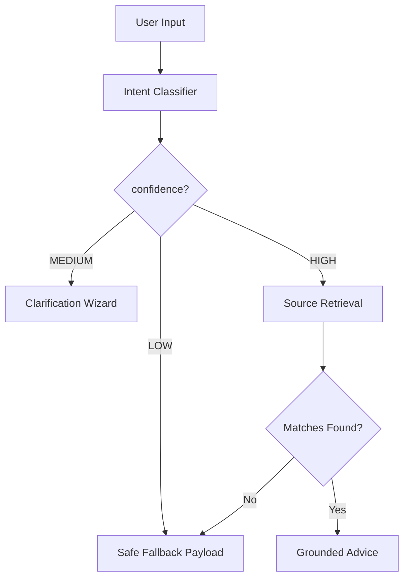

# Phase 3: Open-Ended Civic Problem Handling

This document details the architecture, taxonomy, routing layers, clarification wizards, and grounding verification tests built during Phase 3 to handle arbitrary open-ended citizen inputs responsibly.

---

## 1. Structured Civic Problem Taxonomy

We created a structured 15-category taxonomy to organize citizen concerns, direct database search scopes, and identify unsupported queries:

1. **Housing / Tenant**: Rental agreements, withholding deposits, eviction notices.
2. **Employment / Wage**: Delayed pay, unpaid salaries, arbitrary contract termination.
3. **Consumer / Refund**: Defective items, online purchases, seller refund refusal.
4. **Police / Public Authority**: Excessive use of force, threats/intimidation, illegal arrest.
5. **Education**: Scholarship schemes, college certificate withholding, enrollment disputes.
6. **Healthcare / Public Health**: Medical negligence, hospital refusal of services.
7. **Accessibility / Disability**: Public transport barriers, workplace accommodation gaps.
8. **Public Utilities**: Water connection delays, arbitrary power meter faults.
9. **Sanitation / Waste**: Local garbage collection neglect, public rubbish dumping.
10. **Roads / Public Infrastructure**: Damaged road potholes, broken pavements.
11. **Local Government Services**: Birth/death certificate delay, trade license queries.
12. **Identity / Public Documents**: Income certificate application assistance.
13. **Public Safety**: Fire safety failures, commercial area hazards.
14. **Environmental / Pollution**: River waste dumping, factory smoke complaints.
15. **Other Civic Issue**: Generic fallback queries outside specific domains.

---

## 2. Intent Routing Pipeline

The engine executes this multi-tier pipeline:

### Routing Classifications
- **HIGH**: Query maps to a supported category (e.g. landlord withholding deposit) and matches local database indexes.
- **MEDIUM**: Category is matched but input is vague or requires details (e.g. general police brutality or workplace disputes). Triggers the **Clarification Wizard**.
- **LOW**: The query is completely out-of-scope (e.g. recipe inquiries). Triggers the **Safe Fallback card** immediately.

---

## 3. Reusable Clarification Engine

Instead of making AI guesses, vague queries are halted to ask 1–3 multiple-choice clarification questions:

*   **Police misconduct flow**:
    1.  *What happened?* (Excessive force | Threat/intimidation | Detention/arrest | Damage | Other)
    2.  *Where did it happen?* (Police station | During arrest | Public street | Other)
    3.  *Do you have evidence?* (Yes | No | Not sure)
*   **Employment disputes flow**:
    1.  *What is the core issue?* (Unpaid wages | Termination | Harassment | Working conditions | Other)

Answers are appended to the citizen prompt before execution to optimize database search accuracy.

---

## 4. Grounded AI & Safe Fallback Experience

If a query is unsupported or the database returns zero matches, the system does not query Gemini for advice. Instead, it displays the visual safe fallback layout:

-   **WE UNDERSTAND**: Maps the detected category (e.g. "Sanitation / Waste").
-   **WHAT WE CAN HELP WITH**: Explains how they can document the incident.
-   **WHAT WE CANNOT VERIFY YET**: States: *"We do not currently have enough verified source material to provide a case-specific answer. We will not guess."*
-   **WHAT WOULD HELP**: Interactive list requesting fact details (What, When, Where, Who, and Evidence status).

---

## 5. Expanded Knowledge-Base Sources

We added three new verified JSON documents under `knowledge-base/rights/` using the standardized structure:

1.  **[`police_complaints.json`](file:///c:/Users/Sampreeth/Desktop/AI-CIVIC-ENGINE/knowledge-base/rights/police_complaints.json)**: Filing guidelines before the independent state Police Complaints Authority (PCA) under the Supreme Court Prakash Singh reforms.
2.  **[`sanitation_waste.json`](file:///c:/Users/Sampreeth/Desktop/AI-CIVIC-ENGINE/knowledge-base/rights/sanitation_waste.json)**: Sanitation guidelines under the Solid Waste Management Rules, 2016.
3.  **[`road_infrastructure.json`](file:///c:/Users/Sampreeth/Desktop/AI-CIVIC-ENGINE/knowledge-base/rights/road_infrastructure.json)**: Pavement and pothole maintenance timelines under PWD Citizens' Charters.

---

## 6. Verification Test Matrix Results

The sanity suite `api_sanity_check.js` was upgraded to evaluate 13 test cases. All passed:

| Test ID | Case Name | Sample Query | Expected Module | Expected Category | Expected Confidence | Grounding / Fallback Result |
| :--- | :--- | :--- | :--- | :--- | :--- | :--- |
| **1** | Tenant Problem | *"My landlord hasn't returned my deposit."* | RIGHTS_NAVIGATOR | Housing / Tenant | HIGH | Grounded (Tenant Rights) |
| **2** | Workplace Wages | *"My employer hasn't paid my wages."* | RIGHTS_NAVIGATOR | Employment / Wage | HIGH | Grounded (Workplace Rights) |
| **3** | Consumer Refund | *"My phone seller refuses a refund."* | RIGHTS_NAVIGATOR | Consumer / Refund | HIGH | Grounded (Consumer Rights) |
| **4** | Police Misconduct | *"Police used excessive force during an incident."* | RIGHTS_NAVIGATOR | Police / Public Authority | MEDIUM | Grounded (PCA complaints) |
| **5** | Civic Sanitation | *"Garbage hasn't been collected in my street."* | RIGHTS_NAVIGATOR | Sanitation / Waste | HIGH | Grounded (SWM Rules 2016) |
| **6** | Road / Infrastructure | *"Pothole damaged street repair required."* | RIGHTS_NAVIGATOR | Roads / Public Infrastructure | HIGH | Grounded (PWD charter) |
| **7** | Scheme Query | *"Can I qualify for government scholarship Yashasvi?"* | SCHEME_ELIGIBILITY | Education | HIGH | Grounded (PM-YASASVI) |
| **8** | RTI Query | *"allocated road budget MG Road spent under RTI"* | RTI_DRAFTING | Roads / Public Infrastructure | HIGH | Grounded (RTI draft) |
| **9** | Form Query | *"help fill out income certificate application form"* | FORM_FILLER | Identity / Public Documents | HIGH | Grounded (Income form) |
| **10** | Ambiguous Query | *"my employer is treating me unfairly"* | RIGHTS_NAVIGATOR | Employment / Wage | MEDIUM | Clarification Triggered |
| **11** | Completely Unsupported | *"how to cook pasta at home"* | RIGHTS_NAVIGATOR | Other Civic Issue | LOW | **Unsupported Fallback** |
| **12** | Empty Input | *""* | RIGHTS_NAVIGATOR | Other Civic Issue | LOW | **Unsupported Fallback** |
| **13** | Form Correction | *N/A (Form Filler edit payload)* | FORM_FILLER | Identity / Public Documents | HIGH | Live edit validated successfully |

---

## 7. Known Limitations

-   **Keyword Overlaps**: Very complex queries referencing multiple issues (e.g. "my landlord threatened to call the police on me") might get routed to the highest weighted keyword match (e.g. Housing / Tenant) instead of triggering a double-clarification flow.
-   **Static PCA Complaint Addresses**: Independent state PCA physical office addresses are not detailed dynamically. The user is referred to local directories.
